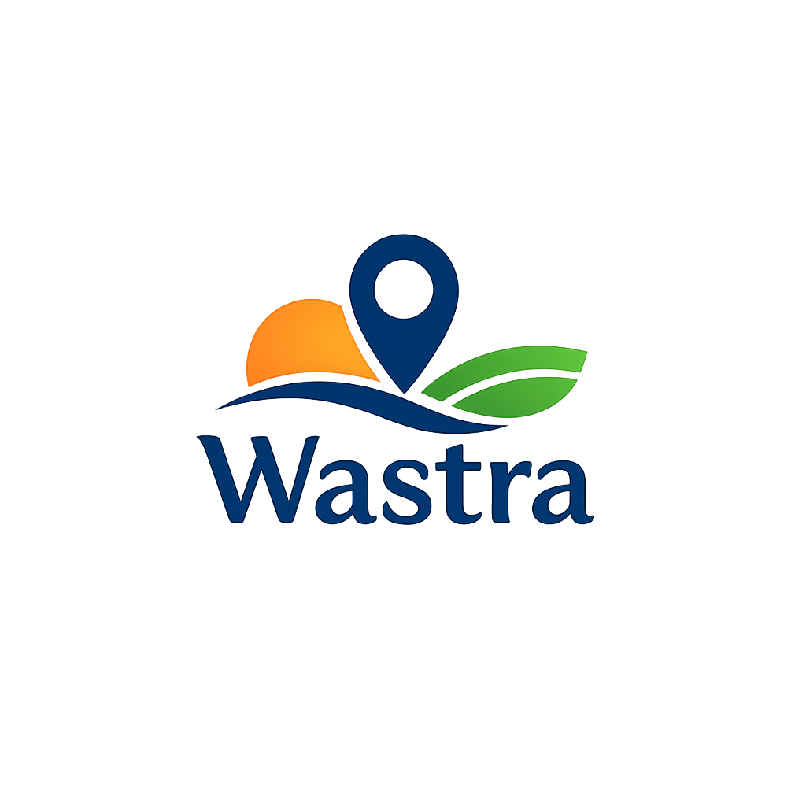

<p align="center">
  
</p>

<h1 align="center">Wastra</h1>

<p align="center"><em>Smart Tourism Platform — pantau keramaian wisata Indonesia secara real-time.</em></p>

<p align="center">
  <a href="https://github.com/ravi-arnan/ProjectWastra/actions/workflows/ci.yml"></a>
</p>

<p align="center">
  
  
  
  
  
  
  
</p>

<p align="center">
  
  
</p>

<p align="center">
  <strong><a href="https://project-wastra.vercel.app">Live demo</a></strong>
</p>

> Dibangun untuk **AstraPay Hackathon 2026**.

---

**Wastra** adalah Progressive Web App (PWA) yang membantu wisatawan dan pengelola/otoritas wisata memantau **kepadatan pengunjung secara real-time** di destinasi wisata seluruh Indonesia. Lewat data okupansi langsung, prediksi berbasis AI, dan rekomendasi cerdas, Wastra mendorong pariwisata berkelanjutan dan membantu pengunjung menghindari titik yang terlalu ramai — sekaligus memberi pengelola alat pemerataan kunjungan.

---

## Features

- **Real-time Density Tracking** — Tingkat keramaian langsung di 25 destinasi nasional dengan status berwarna (Sepi, Sedang, Ramai, Sangat Ramai)
- **Interactive Map** — Peta berbasis Leaflet dengan marker kepadatan berdenyut, pencarian, dan bottom sheet detail destinasi
- **AI Prediction Analysis** — Prakiraan keramaian 7 hari dengan rincian per jam dan kartu faktor prediksi (cuaca, event, tren sosial, hari libur)
- **Destination Comparison** — Bandingkan dua destinasi berdampingan (kepadatan, estimasi antrean, prakiraan, harga tiket) dengan state tersimpan di URL
- **Smart Recommendations** — Alternatif yang lebih sepi, dipersonalisasi berdasarkan lokasi dan kepadatan saat ini
- **Watchlist + Density Alerts** — Simpan destinasi favorit dan dapatkan notifikasi saat keramaiannya turun di bawah ambang yang Anda atur
- **Authority Insights** — Dasbor otoritas: sebaran pengunjung per kabupaten & kategori, beban kapasitas, dan prakiraan se-Nusantara
- **Tourism Manager Dashboard** — Dasbor khusus pengelola lokal untuk destinasi yang ditugaskan (overview, peta, prediksi, laporan)
- **AI Agent** — Asisten percakapan untuk rekomendasi & itinerary, dengan konfigurasi provider/model oleh admin
- **Authentication** — Email/password, tamu (anonymous), dan **Google sign-in** via Supabase
- **PWA Support** — Bisa di-install ke layar utama dengan service worker siap offline
- **Responsive Design** — UI mobile-first adaptif dengan layout desktop khusus (sidebar, bento grid), bilingual (ID/EN)

---

## Tech Stack

> 📚 Lihat **[docs/TECH_STACK.md](docs/TECH_STACK.md)** untuk rincian lengkap (frontend, mobile/Capacitor, backend, AI/ML, infra) dan diagram arsitektur.
>
> 📄 Dokumen lain: **[docs/PERFORMANCE.md](docs/PERFORMANCE.md)** (postur bundle & performa) · **[docs/ACCESSIBILITY.md](docs/ACCESSIBILITY.md)** (WCAG 2.2 & konvensi a11y) · **[docs/ANDROID.md](docs/ANDROID.md)** (build APK).

| Layer | Technology |
|-------|-----------|
| **Framework** | [React 19](https://react.dev) + [TypeScript 6](https://www.typescriptlang.org/) |
| **Build Tool** | [Vite 8](https://vite.dev) |
| **Styling** | [Tailwind CSS 4](https://tailwindcss.com) dengan token warna Material Design 3 |
| **Routing** | [React Router 7](https://reactrouter.com) |
| **Animation** | [Motion](https://motion.dev) |
| **Maps** | [Leaflet](https://leafletjs.com) + [React Leaflet](https://react-leaflet.js.org) |
| **Backend** | [Supabase](https://supabase.com) — Auth (email, anonymous, Google OAuth), Postgres + RLS |
| **i18n** | [react-i18next](https://react.i18next.com) (Bahasa Indonesia / English) |
| **PWA** | [vite-plugin-pwa](https://vite-pwa-org.netlify.app) (service worker, web manifest) |
| **Icons** | [Material Symbols](https://fonts.google.com/icons) (self-hosted subset, ~25KB) |
| **Fonts** | Plus Jakarta Sans (judul) + Manrope (isi) |
| **Hosting** | [Vercel](https://vercel.com) |

---

## Pages

| Route | Page | Description |
|-------|------|-------------|
| `/` | Landing | Halaman marketing — hero, bento fitur, preview peta, CTA |
| `/auth` | Auth | Login / daftar — email, tamu, Google |
| `/app` | Home | Dashboard — sapaan, pencarian, filter kategori, destinasi populer, rekomendasi |
| `/app/peta` | Peta | Peta Leaflet interaktif dengan marker kepadatan, legenda, bottom sheet |
| `/app/destinasi/:id` | Detail | Halaman destinasi — gauge keramaian, cuaca, analitik zona, rating, booking, alternatif |
| `/app/bandingkan` | Bandingkan | Perbandingan dua destinasi berdampingan |
| `/app/prediksi` | Prediksi | Prakiraan — watchlist, grafik 7 hari, rincian per jam, faktor prediksi |
| `/app/watchlist` | Watchlist | Destinasi tersimpan + alert kepadatan dengan ambang |
| `/app/profil` | Profil | Profil — info user, statistik, pengaturan, manajemen akun |
| `/app/otoritas` | Authority Insights | Dasbor otoritas (admin) — sebaran kunjungan, beban kapasitas, prakiraan |
| `/dashboard` | Tourism Dashboard | Dasbor pengelola (admin / local manager) — overview, peta, prediksi, laporan, destinasi |
| `/app/admin` · `/app/ai-agent` · `/app/user-management` · `/app/audit-logs` | Admin | Panel admin — tools, konfigurasi AI Agent, manajemen user, audit log |

---

## Roles & Access

| Role | Akses |
|------|-------|
| **Visitor** | Semua halaman publik `/app/*`, peta, prediksi, perbandingan, watchlist |
| **Local Manager** | + `Tourism Dashboard` untuk destinasi yang ditugaskan (`public.local_managers`) |
| **Admin** | + Authority Insights, semua destinasi di dashboard, AI Agent, manajemen user, audit log (`public.admins`) |

Peran ditegakkan di klien (route guard) **dan** di database lewat Row Level Security pada Supabase.

---

## Getting Started

### Prerequisites

- [Node.js](https://nodejs.org/) >= 20
- Sebuah proyek [Supabase](https://supabase.com) (free tier cukup)

### Installation

```bash
git clone https://github.com/ravi-arnan/ProjectWastra.git
cd ProjectWastra
npm install
```

### Configuration

Salin template env dan isi kredensial Supabase Anda:

```bash
cp .env.example .env
```

Edit `.env`:

```env
VITE_SUPABASE_URL=https://your-project.supabase.co
VITE_SUPABASE_ANON_KEY=your-anon-key
```

> **Google sign-in (opsional):** aktifkan provider Google di Supabase Dashboard
> (Authentication → Providers) dan daftarkan redirect URI
> `https://<project-ref>.supabase.co/auth/v1/callback` di Google Cloud Console.
> Client ID/Secret hanya disimpan di Supabase — **jangan** commit ke repo.

### Development

```bash
npm run dev
```

Terbuka di [http://localhost:5173](http://localhost:5173).

### Build

```bash
npm run build
npm run preview   # Preview production build secara lokal
```

### Icon font

Ikon memakai subset Material Symbols yang di-self-host. Setelah **menambah ikon baru** di kode, regenerate subsetnya agar tidak tampil sebagai teks:

```bash
node scripts/generate-icon-subset.mjs
```

---

## Design System

Aplikasi memakai sistem warna terinspirasi **Material Design 3** dengan token kustom:

| Token | Hex | Usage |
|-------|-----|-------|
| `primary` | `#00647c` | Aksi utama, state aktif |
| `primary-container` | `#007f9d` | Permukaan primary terangkat |
| `tertiary` | `#825100` | Peringatan / kepadatan sedang |
| `error` | `#ba1a1a` | Kepadatan tinggi, alert |
| `surface` | `#fff8f5` | Latar halaman |
| `on-surface` | `#1f1b17` | Teks utama |

Tingkat kepadatan diberi kode warna:
- **Sepi** (< 30%) — `primary` (teal)
- **Sedang** (30–60%) — `amber`
- **Ramai** (60–80%) — `tertiary` (oranye)
- **Sangat Ramai** (> 80%) — `error` (merah)

---

## License

Dibangun untuk **AstraPay Hackathon 2026**. All rights reserved.
